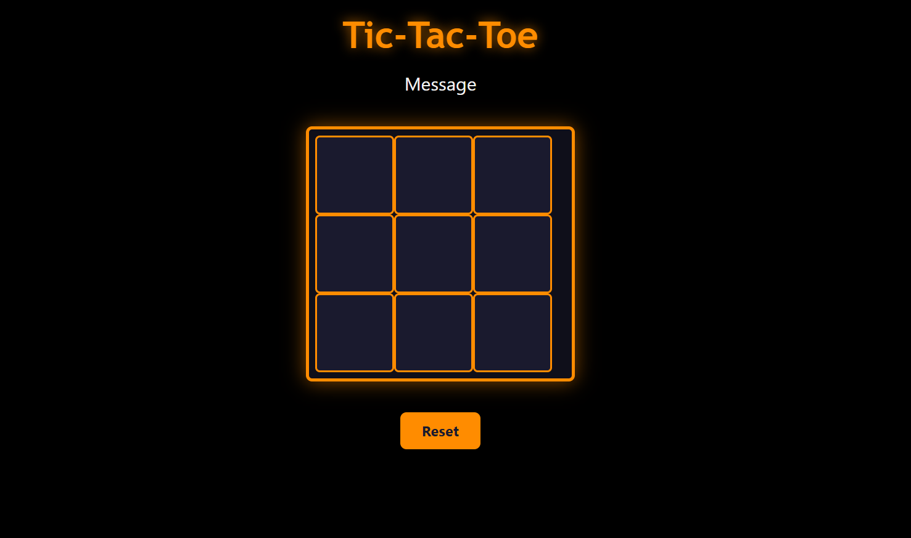

# **Tic Tac Toe (XO)**

## Tecchnology used
1. Html
2. CSS
3. JavaScript

## Description
This is the classic XO Game. Each person gets 1 turn. If you get 3 squares of the same of value.

## User Stories
1. As a User, I want to see 3x3 grid board
2. As a User, I want to click on a square to place my X or O.
3. As a User, I want to see if I win if I get 3 Xs in a row.
4. As a User, I want to see a tie message if no player wins.
5. As a User, I want to see a restart button and when I click it the game should reset.

## Screenshots

